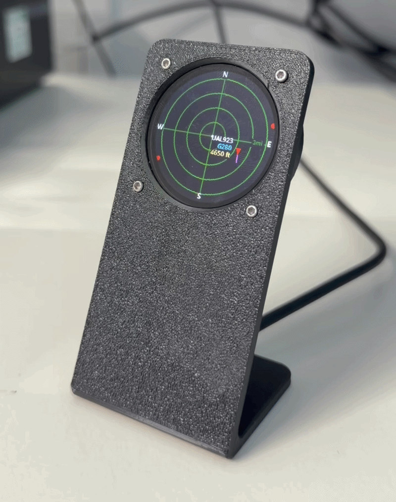

# Plane Radar

<p align="center">
  
</p>

**3D printed case (STL + assembly):** [MakerWorld](https://makerworld.com/en/models/2913572-esp32-s3-1-28-waveshare-plane-radar#profileId-3258909). **Firmware:** [Releases](https://github.com/theprintablewatch/ESP32-Plane-Radar/releases)

Firmware for the **Waveshare ESP32-S3 Touch LCD 1.28** (round GC9A01 display, 240×240). Shows a circular **ADS-B radar** around your configured location, with **WiFiManager** for first-time setup.

## What's different in this fork

Changes from the upstream project:

- **Satellite radar** - a second radar showing satellites currently overhead as a sky plot (zenith at the centre, horizon at the rim), with each satellite drawn as a triangle pointing in its direction of travel. Live positions come from the free [N2YO](https://www.n2yo.com/api/) *above* API
- **Tap to cycle views** - a single tap on the touch screen cycles **Plane radar → Satellite radar → IP address**, and each view stays until the next tap
- **UK postcode → coordinates** - enter a UK postcode in the web settings and it's geocoded to lat/lon via [postcodes.io](https://postcodes.io) (no API key)
- **Web settings page** - adjust location, range, miles/km, **top bearing** (display rotation), and the **N2YO API key / satellite category** from a browser at `plane-radar.local`, no reflash needed
- **UK airport overlays** - nearby UK airports drawn on the radar grid
- **Slimmed firmware** - removed the bundled large-airports dataset and runway-overlay feature

## What it does

1. **Wi‑Fi setup** (if needed) - captive portal on AP **`PlaneRadar-Setup`**
2. **Plane radar** - live aircraft from [adsb.fi](https://opendata.adsb.fi/) on a sonar-style grid
3. **Satellite radar** - satellites overhead from [N2YO](https://www.n2yo.com/api/) on a sky plot (needs a free API key)
4. **IP address** - the device IP, handy for reaching the web settings page

After Wi‑Fi is saved, the device reconnects automatically; the radar runs in the main loop with periodic ADS-B updates (~3 s). **Tap** the screen to cycle between the three views.

## Assembly hardware

To assemble the 3D printed case you'll need:

- **4 × M1.6 × 10 mm** screws
- **4 × M1.6** nuts

## Controls

**Touch screen** (CST816S capacitive):

| Action | Effect |
|--------|--------|
| **Tap** | Cycle view: Plane radar → Satellite radar → IP address |

The view stays put until the next tap. Idle reads are gated on the touch INT line, so the panel can sleep and the I2C bus stays quiet when you're not touching it.

**BOOT button** (GPIO 0, active LOW):

| Action | Effect |
|--------|--------|
| **Short tap** | Cycle range preset (5 → 10 → 15 → 25 km); saved to flash |
| **Hold 3 s** | Clear Wi‑Fi, location, and units; reboot into setup portal |

During setup you can also hold BOOT at power-on to force a credential reset (same as the long press).

## Wi‑Fi setup portal

1. Connect to **`PlaneRadar-Setup`**
2. Open **`http://plane-radar.local`** (preferred) or **`http://192.168.4.1`** - both are shown on the yellow setup screen; captive portal may open automatically
3. Set home Wi‑Fi, then save

mDNS hostname is configured in `config.h` as `kPortalHostname` (`plane-radar` → **plane-radar.local** on the setup AP). Some phones resolve `.local` slowly; use the IP if needed.

**Custom fields** (stored in NVS):

| Field | Purpose |
|-------|---------|
| **Latitude / Longitude** | Radar center and ADS-B query position (defaults in `config.h` until set) |
| **Display distances in miles** | Ring scale label in **mi** instead of **km** (e.g. `6mi` vs `10km`) |
| **Top bearing** | Rotates the display so a chosen compass bearing points up |
| **N2YO API key** | Enables the satellite radar (free key from [n2yo.com/api](https://www.n2yo.com/api/)) |
| **Satellite category** | Which N2YO group to show (Brightest, ISS, Starlink, GPS, …) |

After a reset, the device reboots and shows the setup screen immediately (no “Connecting” loop on stale credentials).

## Radar display

### Grid

- Dark blue background, subdued green rings and crosshairs
- White **N / S / E / W** at the bezel; range label on the **east** spoke (ring 3 = ¾ of outer radius)
- White center dot

Layout and colors: `include/ui/radar_theme.h`.

### Range presets

| Ring 3 label | Outer radius (aircraft scale) |
|------------|-------------------------------|
| 5 km / 3 mi | ~6.7 km |
| 10 km / 6 mi | ~13.3 km (default) |
| 15 km / 9 mi | ~20 km |
| 25 km / 16 mi | ~33.3 km |

Preset and miles/km choice persist across reboot (`planeradar` NVS namespace).

### Aircraft

- **Inside the outer ring** - red heading triangle, magenta speed vector (clipped at the ring), callsign / type / altitude tags
- **Outside the ring** (still within ADS-B fetch) - small **red dot on the screen rim** at the correct bearing (direction cue; not distance-accurate past the ring)
- **Tags** - placed toward the **center**: west (left) → tag on the **right** of the symbol; east (right) → tag on the **left**

As range decreases (or aircraft approach), targets move inward; beyond-ring dots become full symbols when they cross the outer ring.

### ADS-B

- Source: `https://opendata.adsb.fi/api/v3/`
- Fetch radius: `ui::radar::fetchRadiusKm()` - scales with the active preset to roughly the screen edge (so rim dots have data)
- Poll interval: `kAdsbFetchIntervalMs` (5 s) in `config.h`
- Ground aircraft hidden by default (`kAdsbShowGroundAircraft`)

## Satellite radar

Tap the screen until you reach the **satellite** view. It's a sky plot:

- **Centre = zenith** (straight up), **outer ring = horizon**; rings mark 30° / 60° elevation
- Blue crosshairs and elevation rings; white **N / E / S / W** at the rim
- Each satellite is a triangle pointing in its **direction of travel**, with a name label on the highest few

### Setup

1. Get a free API key at **[n2yo.com/api](https://www.n2yo.com/api/)** (registration only; ~1000 requests/hour)
2. Open **`plane-radar.local`**, paste the key into **N2YO API key**, pick a **Satellite category**, and Save
3. Tap to the satellite view - it polls N2YO every ~15 s

Until a key is set, the satellite view shows a prompt. Direction of travel is derived from the change between two fetches, so a satellite's triangle settles onto its real heading after the second poll.

> **Note:** category `0` (*all*) is intentionally not offered - its response is far too large for the ESP32. "Brightest" is the default and a good starting point; some categories (e.g. ISS) often show nothing when none of that group is above you.

## Configuration

Edit **`include/config.h`** for hardware and behavior:

| Area | Keys / notes |
|------|----------------|
| Portal | `kPortalApName`, `kPortalIp`, `kPortalHostname` / `kPortalHostUrl` (mDNS; needs `-DWM_MDNS` in `platformio.ini`) |
| Wi‑Fi timing | connect attempts, reconnect grace, portal timeout (`0` = no timeout) |
| BOOT | `kBootPin`, `kBootResetHoldMs`, `kBootTapMinMs` |
| Touch (CST816S) | `kTouchPinSda/Scl/Int/Rst`, `kTouchI2cAddr` |
| Display SPI | pins, `kDisplayInvert`, `kDisplayRgbOrder`, `kDisplaySpiWriteHz` |
| Default location | `kDefaultRadarLat`, `kDefaultRadarLon` (until portal overrides) |
| ADS-B | `kAdsbFetchIntervalMs`, `kAdsbShowGroundAircraft` |
| Satellites | `kSatCategory` (default), `kSatCategories[]`, `kSatSearchRadiusDeg`, `kSatFetchIntervalMs` |

Range presets: `include/ui/radar_range.h` (`kRangePresets`).

## Project layout

```
include/
  config.h
  hardware/
    lgfx_config.hpp
    display.h
    display_font.h
  ui/
    radar_theme.h
    radar_range.h
    radar_display.h
    status_screens.h
  services/
    wifi_setup.h
    radar_location.h
    adsb_client.h
data/
  ui_font.vlw              - embedded smooth UI font (Noto Sans Bold)
src/
  main.cpp
  hardware/
  ui/
  services/
```

## Wiring (GC9A01 ↔ ESP32-C3 Super Mini)

| Display | ESP32-C3 |
|---------|----------|
| VCC | 3V3 |
| GND | GND |
| RST | GPIO **0** |
| CS | GPIO **1** |
| DC | GPIO **10** |
| SDA (MOSI) | GPIO **3** |
| SCL (SCLK) | GPIO **4** |
| BOOT (user) | GPIO **9** |

## Build

```bash
pio run -e supermini -t upload    # ESP32-C3 Super Mini + round GC9A01
pio device monitor
```

- PlatformIO env: **`supermini`**
- Serial: **115200** baud
- USB CDC on boot enabled in `platformio.ini` for the Super Mini

### Alternate board: Waveshare ESP32-S3-Touch-LCD-4.3B

A second build target drives a [Waveshare ESP32-S3-Touch-LCD-4.3B](https://www.waveshare.com/wiki/ESP32-S3-Touch-LCD-4.3B) (800×480 RGB-parallel LCD, GT911 touch, CH422G IO expander). The round-display build is unchanged.

```bash
pio run -e waveshare43b -t upload
```

- Layout: the radar circle fills a ~400×400 region on the left; the right side is a **live traffic list** (callsign · type · altitude · distance, nearest first).
- Touch: tap anywhere shows the device IP for 5 s (same as the round build). The **BOOT** button cycles range presets.
- Requires the N16R8 module (16 MB flash / 8 MB PSRAM); the RGB framebuffer and background sprite live in PSRAM.
- If the screen is blank or garbled on first flash, the likely culprits are commented in `include/hardware/lgfx_config.hpp` (RGB `freq_write`), `include/config.h` (CH422G EXIO bit map, GT911 address `0x14`/`0x5D`).

### Web-flashable release image

Single `.bin` for [esptool-js](https://espressif.github.io/esptool-js/) and similar tools (ESP32-C3, 4 MB, flash at **0x0**):

```bash
chmod +x scripts/merge-firmware.sh   # once
./scripts/merge-firmware.sh
```

Writes `release/plane-radar-merged.bin`. Skip rebuild if firmware is already built:

```bash
./scripts/merge-firmware.sh --no-build
```

Or via PlatformIO only (output: `.pio/build/supermini/firmware-merged.bin`):

```bash
pio run -e supermini
pio run -t merge -e supermini
```

Put the board in download mode (hold **BOOT**, tap **RESET**), then flash with Chrome/Edge over USB.

### CI and releases (GitHub Actions)

| Workflow | When | Output |
|----------|------|--------|
| [Build](.github/workflows/build.yml) | Push / PR to `main` | Artifact `plane-radar-supermini` (merged + split `.bin` files, ~90 days) |
| [Release](.github/workflows/release.yml) | Git tag `v*` (e.g. `v1.0.0`) | GitHub Release asset `plane-radar-v1.0.0.bin` + `.sha256` |

To ship a version users can download:

```bash
git tag v1.0.0
git push origin v1.0.0
```

The release workflow builds firmware in CI and attaches the merged image to the release. Download from **Releases** on GitHub, then flash at **0x0** (ESP32-C3, 4 MB).

## Dependencies

- [LovyanGFX](https://github.com/lovyan03/LovyanGFX)
- [WiFiManager](https://github.com/tzapu/WiFiManager)
- [ArduinoJson](https://github.com/bblanchon/ArduinoJson)
